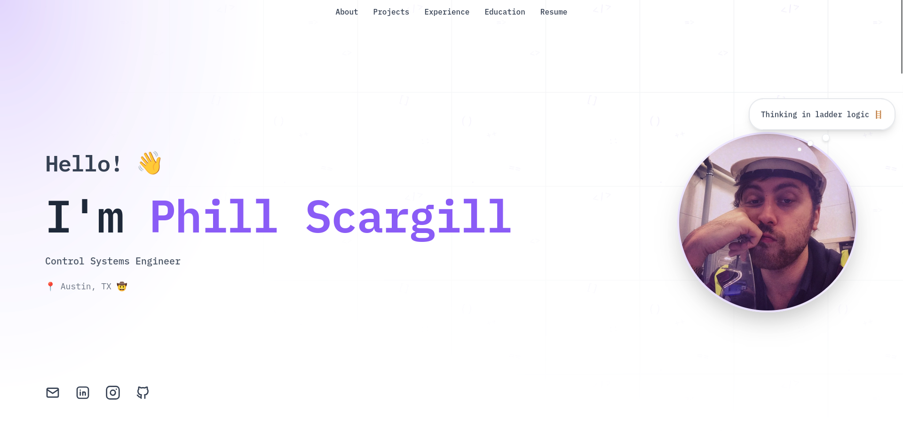
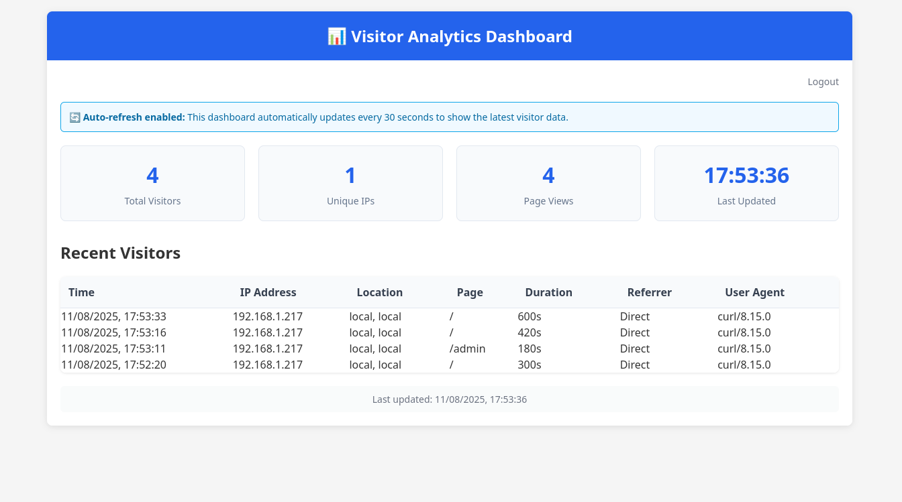

# Phill Scargill - Portfolio

A personal portfolio website showcasing my work as a Control Systems Engineer, forked from [Ryan Fitzgerald's DevPortfolio template](https://github.com/RyanFitzgerald/devportfolio).

## Changes Made to Original Template

### Design & UI Enhancements
- **Profile Picture**: Added responsive profile photo that scales properly on both PC and mobile
- **Thought Bubble**: Added animated floating thought bubble with "Thinking in ladder logic 🪜" text
- **Project Animations**: Enhanced project boxes with floating bubble emoji animations on hover
- **Responsive Layout**: Fixed name wrapping issues and improved mobile scaling

### Technical Infrastructure
- **Framework Migration**: Converted from static HTML/CSS to **Astro** with **Tailwind CSS**
- **Server-Side Rendering**: Implemented `output: 'server'` for dynamic functionality
- **Docker Deployment**: Containerized with Node.js runtime and persistent data volumes
- **Nginx Proxy**: Configured for production deployment with SSL support

### Visitor Tracking System
- **Self-Hosted Analytics**: Built-in visitor tracking without third-party services
- **Data Collection**: Tracks page views, unique visitors, IP addresses, location, visit duration, and referrer data
- **Persistent Storage**: File-based JSON storage with Docker volume persistence
- **Real-Time Dashboard**: Auto-refreshing admin panel that updates every 30 seconds

### Accessibility & SEO
- **Meta Tags**: Comprehensive Open Graph, Twitter Cards, and SEO meta tags
- **Structured Data**: JSON-LD schema markup for better search engine understanding
- **ARIA Attributes**: Enhanced screen reader support and semantic HTML
- **Focus Management**: Improved keyboard navigation and focus indicators
- **Robots.txt & Sitemap**: Search engine optimization files

### Security Features
- **Password Protection**: Secure admin dashboard with environment variable authentication
- **Data Privacy**: Visitor data stored locally, no external tracking services
- **Secure Headers**: Proper cache control and security headers

## Screenshots

  <table>
    <tr>
      <td align="center">
        
         
        <em>Main portfolio page with profile picture and thought bubble</em>
      </td>
      <td align="center">
        
         
        <em>Real-time visitor analytics dashboard</em>
      </td>
    </tr>
  </table>

## Technologies Used

- **Frontend**: Astro, Tailwind CSS, TypeScript
- **Backend**: Node.js, File system storage
- **Deployment**: Docker, Nginx Proxy Manager
- **Hosting**: Self-hosted on home server

## Contact

- **Email:** phill.scargill@gmail.com
- **LinkedIn:** [Phillip Scargill](https://www.linkedin.com/in/phillip-scargill-4a709a274/)
- **GitHub:** [Ph-ill](https://github.com/Ph-ill)
- **Location:** Austin, TX

## License

This project is MIT licensed. See LICENSE.md for details.
